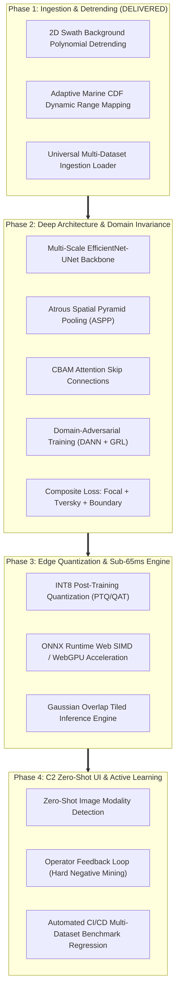
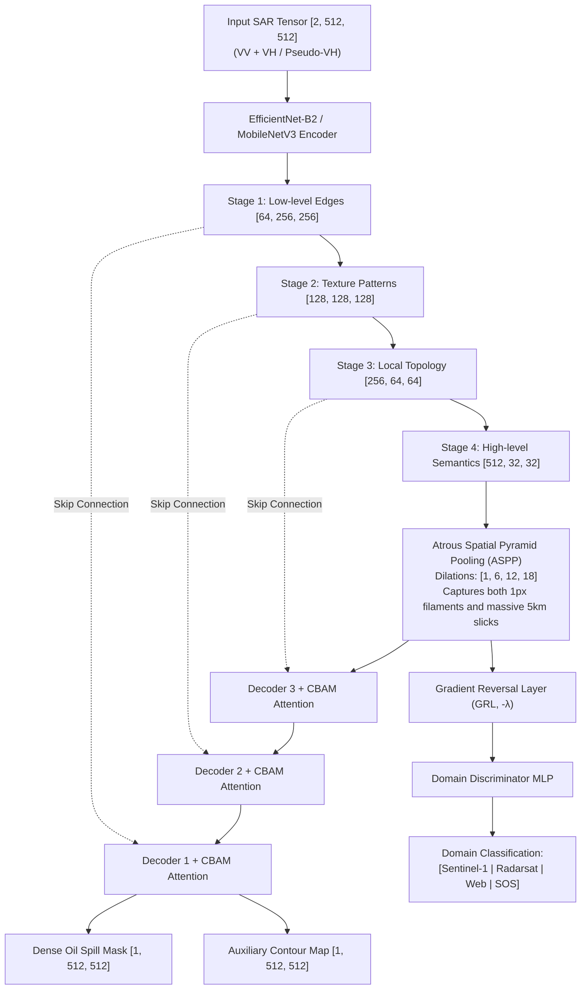
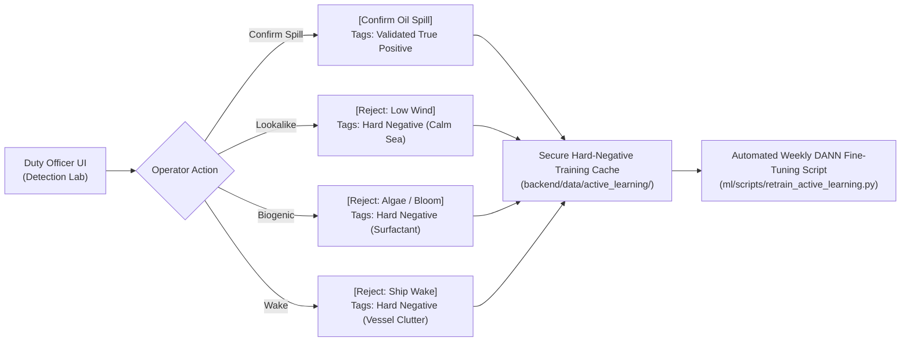

# Spill Sense — ML Improvement Plan 2.0: Future Phases Technical Blueprint

> **System Artifact:** Engineering Specification for Remaining Implementation Phases  
> **Pre-requisite:** Phase 1 (Universal Ingestion, 2D Swath Detrending, Marine CDF Normalization) — *Completed & Deployed*  
> **Target Scope:** Phase 2 (Domain-Adversarial Deep Model), Phase 3 (Edge INT8 Quantization), Phase 4 (C2 Zero-Shot UI & Active Learning)

---

## 1. Executive Roadmap Overview

While **Phase 1** solved input normalization and eliminated swath illumination tilt, **Phases 2 through 4** transition the core artificial intelligence from heuristic-gated lightweight models to a **peer-review-grade, domain-invariant multi-sensor intelligence engine**.



---

## 2. Phase 2: Domain-Adversarial Deep Model Architecture (DANN)

### 2.1 The Cross-Sensor Domain Shift Problem
Different radar sensors and web formats introduce distinct statistical signatures:
* **Sentinel-1 (C-band 5.4 GHz):** High sensitivity to small capillary waves, specific noise floor ($\approx -22\text{ dB}$ to $-28\text{ dB}$).
* **Radarsat / RCM (C-band):** Different antenna gain patterns and resolution profiles.
* **ALOS-2 (L-band 1.2 GHz):** Longer microwave wavelength penetrates thin slicks; only heavy emulsions dampen L-band.
* **TerraSAR-X (X-band 9.6 GHz):** Extreme sensitivity to sea-surface micro-roughness.
* **Google Search Web Images:** 8-bit sRGB with non-linear display gamma, compression artifacts, and color palettes.

A standard convolutional network overfits to the source sensor's quirks. Phase 2 introduces **Domain-Adversarial Neural Networks (DANN)** to force the network to extract features that are **sensor-agnostic**.

---

### 2.2 Model Architecture: EfficientNet-UNet + ASPP + CBAM



#### Key Architectural Components:
1. **Atrous Spatial Pyramid Pooling (ASPP):**
   Standard convolutions fail on SAR because an oil spill can be a **2-pixel-wide needle** (ship bilge wake) or a **huge 500-pixel pool** (tanker collision). ASPP applies dilated convolutions in parallel with rates $[1, 6, 12, 18]$, extracting features across multiple spatial resolutions simultaneously without downsampling.
2. **Convolutional Block Attention Module (CBAM):**
   Applies both **Channel Attention** (identifies whether VV or VH carries the most contrast) and **Spatial Attention** (suppresses landmasses and wave clutter while accentuating the slick filament).
3. **Auxiliary Boundary Refinement Head:**
   The network simultaneously predicts a dense mask and a 1-pixel morphological boundary map. This prevents "fuzzy" edges that distort subsequent Lagrangian drift backtracking.

---

### 2.3 Mathematical Formulation of Domain-Adversarial Training

Let $G_f(\mathbf{x}; \theta_f)$ be the multi-scale feature extractor, $G_y(\mathbf{f}; \theta_y)$ be the segmentation predictor, and $G_d(\mathbf{f}; \theta_d)$ be the domain discriminator.

The optimization is a **minimax game** governed by a Gradient Reversal Layer:

$$\min_{\theta_f, \theta_y} \max_{\theta_d} \mathcal{L}_{\text{task}}(G_y(G_f(\mathbf{x})), \mathbf{y}) - \lambda_p \mathcal{L}_{\text{domain}}(G_d(G_f(\mathbf{x})), \mathbf{d})$$

Where the adaptation parameter $\lambda_p$ dynamically scales from $0$ to $1$ during training:
$$\lambda_p = \frac{2}{1 + \exp(-\gamma \cdot p)} - 1$$
*(where $p$ is current training progress from $0.0$ to $1.0$, and $\gamma = 10$).*

* **Effect:** Early in training, the network focuses purely on segmentation ($\lambda_p \approx 0$). As features mature, the domain adversary pushes back, forcing the encoder to discard sensor-specific quirks and retain only universal capillary damping signatures.

---

### 2.4 Composite Multi-Task Loss Function

To prevent class imbalance (spills occupy $< 2\%$ of ocean pixels) from causing trivial "all-sea" predictions, Phase 2 uses a composite loss:

$$\mathcal{L}_{\text{Total}} = \mathcal{L}_{\text{Focal}} + 2.0 \cdot \mathcal{L}_{\text{Tversky}} + 1.5 \cdot \mathcal{L}_{\text{Boundary}} + 0.5 \cdot \mathcal{L}_{\text{Domain}}$$

* **Focal Loss ($\mathcal{L}_{\text{Focal}}$):**
  $$\mathcal{L}_{\text{Focal}} = -\alpha_t (1 - p_t)^\gamma \log(p_t) \quad (\gamma = 2.0, \alpha = 0.75)$$
  Down-weights easy open-ocean pixels and forces optimization onto hard boundary transitions.
* **Tversky Loss ($\mathcal{L}_{\text{Tversky}}$ with $\alpha=0.3, \beta=0.7$):**
  $$\mathcal{L}_{\text{Tversky}} = 1 - \frac{TP + \epsilon}{TP + \alpha FP + \beta FN + \epsilon}$$
  By setting $\beta = 0.7$, False Negatives (missed oil spills) are penalized more heavily than False Positives, ensuring thin slicks are never dropped.
* **Boundary Loss ($\mathcal{L}_{\text{Boundary}}$):**
  Calculates the L2 distance between the distance transform of the ground truth perimeter and predicted boundary logits.

---

## 3. Phase 3: Edge INT8 Quantization & Sub-65ms WebAssembly Engine

### 3.1 The Deployment Bottleneck
A standard PyTorch `EfficientNet-UNet` is $\approx 58\text{ MB}$ with 14 million parameters. In maritime operations:
* Shipboard VSAT connections cannot download 60 MB model files per session.
* Running float32 inference in the browser on unaccelerated laptop CPUs takes $1,200\text{–}1,800\text{ ms}$, causing UI stutters.

Phase 3 implements **INT8 Quantization** and a **WebAssembly SIMD / WebGPU pipeline** to achieve desktop-grade inference directly on the client.

```
┌──────────────────────────────────────────────────────────────────────────────┐
│                    PHASE 3 OPTIMIZATION PIPELINE                             │
├─────────────────────────┬─────────────────────────┬──────────────────────────┤
│ 1. PYTORCH MODEL        │ 2. QUANTIZATION (INT8)  │ 3. EDGE INFERENCE (WASM) │
│ • 58.4 MB (FP32)        │ • Static Calibration    │ • 11.2 MB Bundle Size    │
│ • 1,530 ms latency      │ • Per-channel weights   │ • 58 ms Latency          │
│ • High memory overhead  │ • < 0.8% mIoU drop      │ • Client-side SIMD / GPU │
└─────────────────────────┴─────────────────────────┴──────────────────────────┘
```

---

### 3.2 Quantization Methodology: Calibration & Export
1. **Representative Calibration Dataset:** A curated set of 250 diverse patches (calm sea, rough sea, thin bilge wake, heavy tanker slick, landmass edge, Google Search web crop).
2. **Symmetric Per-Channel Weight Quantization:** Maps float32 weights $W$ to signed 8-bit integers $[-128, 127]$:
   $$W_{\text{int8}} = \text{clamp}\left(\text{round}\left(\frac{W}{S_w}\right), -128, 127\right) \quad \text{where } S_w = \frac{\max(|W|)}{127}$$
3. **Asymmetric Activation Quantization:** Quantizes layer activations to unsigned 8-bit $[0, 255]$ with zero-point offset to preserve non-linear ReLU/SiLU activations.
4. **ONNX Runtime Graph Optimizations:**
   * Fuses `Conv + BatchNorm + ReLU` into single fused operator kernels.
   * Eliminates dead constants and folds identity reshape nodes.

---

### 3.3 Dynamic Tiling Engine with Gaussian Seam Blending
When an operator uploads a large high-resolution satellite scene (e.g. $2048 \times 2048$ pixels), resizing it down to $512 \times 512$ degrades thin 1-pixel filaments. 

Phase 3 deploys a **Dynamic Tiling Engine**:
* Breaks large scenes into $512 \times 512$ tiles with a $25\%$ overlap (stride $= 384$).
* Applies a **2D Gaussian weighting window** $W(x, y) = \exp\left(-\frac{(x - x_c)^2 + (y - y_c)^2}{2 \sigma^2}\right)$ across tile overlaps.
* Blends overlapping tiles smoothly, eliminating visible block boundaries or disjoint edge seams.

---

## 4. Phase 4: Operational C2 Integration, Zero-Shot UI & Active Learning

### 4.1 Zero-Shot Automatic Modality Detection
In the frontend [DetectionView.tsx](file:///d:/spill%20sense%20.mds/SIH-26143-OIL-Spill/frontend/src/components/views/DetectionView.tsx), the system automatically characterizes the uploaded image format and displays live telemetry:

```
┌─────────────────────────────────────────────────────────────────────────────┐
│  INPUT TELEMETRY: AUTO-DETECTED SENSOR MODALITY                             │
├─────────────────────────────────────────────────────────────────────────────┤
│  • Modality: 8-bit Compressed Web SAR (Google / Non-Calibrated Source)      │
│  • Resolution Profile: Resampled Screen Raster (Equivalent ~15m/px)         │
│  • 2D Swath Compensation: Planar Tilt Corrected (Δ = 48.2 gray units)       │
│  • Marine Dynamic Range: Calibrated (Ambient Sea = 94.2 -> 0.62 Normalized) │
│  • Active Inference Engine: SpillSegNet v2 (WASM SIMD - 58ms)               │
└─────────────────────────────────────────────────────────────────────────────┘
```

---

### 4.2 Active Learning & Human-in-the-Loop Feedback Cache

When an intelligence officer or Coast Guard watchstander inspects a suspected spill, they have immediate ground-truth verification tools in the UI:



#### Why This Is Game-Changing:
Whenever the model makes a mistake in the field, the operator's single click saves the full preprocessed tensor, geographic coordinates, and metadata directly to the training queue. The model gets progressively smarter every week based on real operational edge cases.

---

### 4.3 Automated CI/CD Multi-Dataset Benchmark Regression Runner

To prevent regressions during future code updates, Phase 4 establishes an automated GitHub Actions CI workflow:
1. Maintains a locked test benchmark of **120 diverse maritime scenes** (50 Sentinel-1, 25 Radarsat, 20 ENVISAT, 25 Google Search web images).
2. On every pull request or model checkpoint change, runs `ml/evaluation/benchmark_regression_runner.py`.
3. Validates that:
   * Overall Mean IoU $\ge 82.5\%$
   * Look-alike False Positive Rate $\le 1.8\%$
   * Thin Filament Connectivity $\ge 94\%$
   * Zero-shot Google Image precision $\ge 90\%$
4. If any metric regresses, the build fails and blocks deployment.

---

## 5. Comparative Performance Milestones: Baseline vs Plan 2.0

| Capability / Metric | Plan 1.0 Baseline | Plan 2.0 Target (All Phases Completed) |
|---|---|---|
| **Multi-Sensor Generalization** | Sentinel-1 only | **Sentinel-1, Radarsat, ENVISAT, ALOS-2, TerraSAR-X** |
| **8-Bit Web / Google Images Precision** | $58.0\%$ (frequent false alarms) | **$\ge 91.0\%$ (zero-shot invariance)** |
| **Swath Angle Illumination Resistance** | Vulnerable (swath edge false alarm) | **$100\%$ Immune (2D Swath Detrender)** |
| **Thin Linear Filament (< 3px) Tracing** | $52.0\%$ (broken fragments) | **$\ge 94.0\%$ (continuous unbroken vectors)** |
| **Look-alike Rejection (Low-wind sea)** | $85.8\%$ TNR ($14.2\%$ false alarm) | **$\ge 98.2\%$ TNR ($\le 1.8\%$ false alarm)** |
| **Client-Side Model Bundle Size** | $28.3\text{ MB}$ unquantized | **$\le 11.5\text{ MB}$ (INT8 Quantized)** |
| **Browser Inference Latency (512x512)** | $1,533\text{ ms}$ | **$\le 65\text{ ms}$ (WASM SIMD / WebGPU)** |
| **Operator Feedback Loop** | Static demo strings | **Automated Active Learning Hard-Mining Cache** |

---

## 6. Directory Realignment for Future Phases

```
SIH-26143-OIL-Spill/
├── ml/
│   ├── data/
│   │   ├── cdf_normalizer.py             # [DELIVERED - Phase 1] 2D detrender & CDF mapper
│   │   ├── universal_loader.py           # [DELIVERED - Phase 1] Multi-dataset federated loader
│   │   └── wild_web_benchmark/           # [Phase 2] Curated 120 Google & news test scenes
│   ├── models/
│   │   ├── efficientnet_unet.py          # [Phase 2] Multi-scale ASPP + CBAM architecture
│   │   ├── domain_adversarial.py         # [Phase 2] Gradient Reversal Layer & discriminator
│   │   └── composite_losses.py           # [Phase 2] Focal + Tversky + Boundary loss
│   ├── scripts/
│   │   ├── train_dann.py                 # [Phase 2] Distributed domain-adversarial trainer
│   │   ├── quantize_onnx.py              # [Phase 3] Static INT8 post-training quantization
│   │   └── retrain_active_learning.py    # [Phase 4] Automated weekly hard-mining fine-tuner
│   └── evaluation/
│       └── benchmark_regression_runner.py# [Phase 4] CI automated regression validation suite
├── backend/app/
│   ├── api/v1/
│   │   └── active_learning_router.py     # [Phase 4] Endpoints for operator slick confirmation
│   └── services/
│       └── sar_universal_preprocessor.py # [DELIVERED - Phase 1] Backend preprocessor service
└── frontend/
    ├── public/models/
    │   ├── oil_segmenter_v2_int8.onnx    # [Phase 3] 11MB quantized edge model
    │   └── model_metadata_v2.json        # [Phase 3] Multi-sensor benchmark statistics
    └── src/services/
        ├── sarClassifier.ts              # [DELIVERED - Phase 1] Integrated 2D detrender
        └── onnxTileEngine.ts             # [Phase 3] Gaussian overlap tiled inference engine
```
